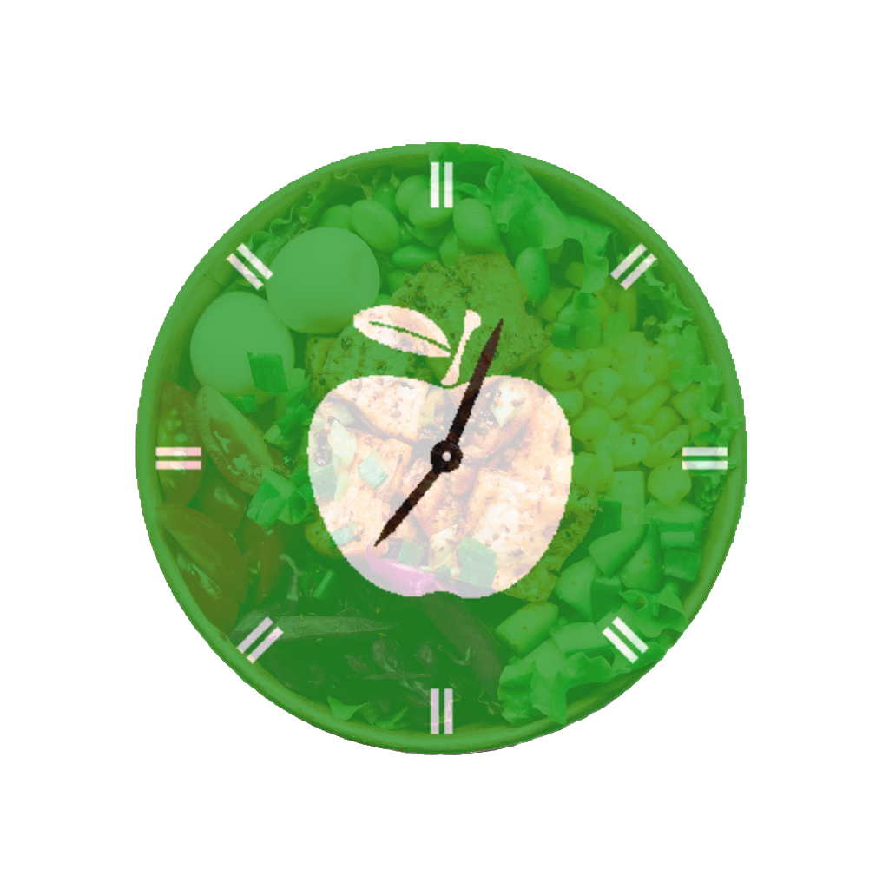

<!--suppress CheckImageSize -->

    

        
        FooDate
    

    

        FooDate is not just a web application, it is your opportunity to reduce food costs and to help in 
        the fight against world hunger.
    

    

        Every year in the world, almost   
        1 billion tons of food is sent to waste.
    

    <a href="https://foodate.ru">
        

            Open FooDate
        

    </a>
    

        This app will help you keep track of the contents of your fridge: shelf life, energy value, etc.
        It will help you make a shopping list and even advise what you can cook.
    

    

        We are what we eat. Control yourself!
    

