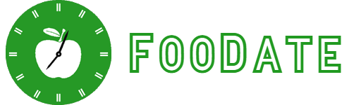

    

[FooDate](https://FooDate.ru) is not just a web application, 
it is your opportunity to reduce food costs and free up time from cooking.

We can make cooking more pleasant!

    

This app will help you keep track of the contents of your fridge: shelf life, energy value, etc. It will help you make a shopping list and even advise what you can cook.

We are what we eat. Control yourself!

## You can

- Track the contents of the refrigerator and monitor the shelf life of products
- Make a permanent list of necessary products and always know what you need to buy
- Monitor the calorie and nutritional content of products
- Cook according to recipes suggested based on the contents of the refrigerator

## Team

- [Vasiliy Nikulin](https://www.github.com/vasil1y-777)
- [Kirill Kozhevnikov](https://github.com/Kirill439867398256)
- [Vsewolod Pritchin](https://github.com/Vsewolod)
- [Aleksandr Gerasimov](https://github.com/Aleksander1Byte)
- Kirill Pronin

## Feedback

If you have any feedback, please reach out to us at foodate@ya.ru

